# Deploying a Nextflix Clone on Kubernetes using DevSecOps methodology

In this project we would be deploying Nextflix Clone application on an EKS cluster using DevSecOps methodology. We would be making use of security tools like SonarQube, OWASP Dependency Check and Trivy.
We would also be monitoring our EKS cluster using monitoring tools like Prometheus and Grafana. Most importantly we will be using ArgoCD for the Deployment.

## Step 1: Launch an EC2 Instance and install Jenkins, SonarQube, Docker and Trivy

We would be making use of Terraform to launch the EC2 instance. We would be adding a script as userdata for the installation of Jenkins, SonarQube, Trivy and Docker.

### 1.1. Applying the Terraform script

1- Access this repository path:
```bash
cd <path>/jenkins-sonarqube-trivy-server
```

2- Initiate Terraform:
```bash
terraform init
```

3- Check and format the terraform files:
```bash
terraform fmt
```

4- Validate the terraform files:
```bash
terraform validate
```

5- Apply the scripts using the environment you want, for instance PRD:
```bash
terraform apply
```

6- Confirm the actions typing `yes`:
```bash
Do you want to perform these actions?

  Terraform will perform the actions described above.
  Only 'yes' will be accepted to approve.
  Enter a value: yes
```

## Step 2: Access Jenkins at port 8080 and install required plugins

Once EC2 is created on your AWS Account:

- Browse Jenkins Dashboard: http://<EC2_Public_IP>:8080

- Login as `admin` user:

    Login User: `admin`

    To find password: `<Password_Here>`

    SSH into the EC2 instance and then:

    ```bash
    [ec2-user@ip-10-0-0-1 ~]$ sudo systemctl status jenkins
    ● jenkins.service - Jenkins Continuous Integration Server
    ...

    Sep 21 18:53:05 ip-10-0-0-1.ec2.internal jenkins[26503]: **<Password_Here>**
    Sep 21 18:53:05 ip-10-0-0-1.ec2.internal jenkins[26503]: This may also be found at: /var/lib/jenkins/secrets/initialAdminPassword
    ```

- Install all recommended Plugins

- Skip and continue as admin

- Install the following required plugins:

1. NodeJS
2. OWASP Dependency-Check   
3. SonarQube Scanner
4. Sonar Quality Gates
5. Quality Gates
6. Eclipse Temurin Installer
7. Docker
8. Docker Commons
9. Docker Pipeline
10. Docker API
11. docker-build-step

## Step 3: Set up SonarQube

For the SonarQube Configuration, first access the Sonarqube Dashboard using the url

- Browse SonarQube Dashboard: http://<EC2_Public_IP>:9000

- Login as `admin` user:

    Login User: `admin`

    Default Admin password: `admin`

- Update admin's default password

1. Create the token 
Administration -> Security -> Users -> Create a token

    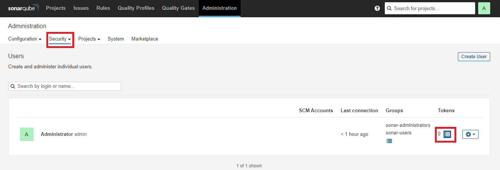

    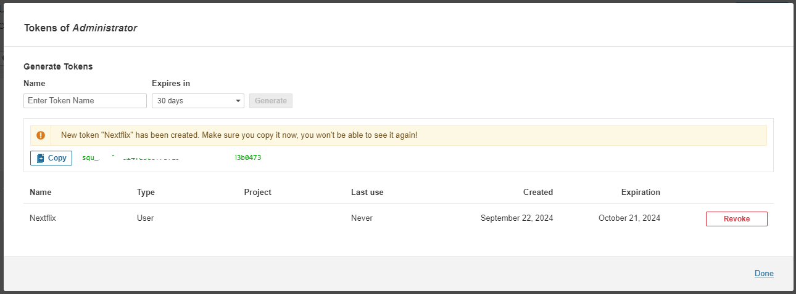

2. Copy and Add this token as a credential in Jenkins:
Go to Manage Jenkins -> Credentials -> System -> Global Credentials -> Add credentials.
Add a new **Secret text** kind credential and token added as **Secret**.

    Kind: `Secret text`

    Secret: `<Sonar User Token>`

    ID: `sonar`

    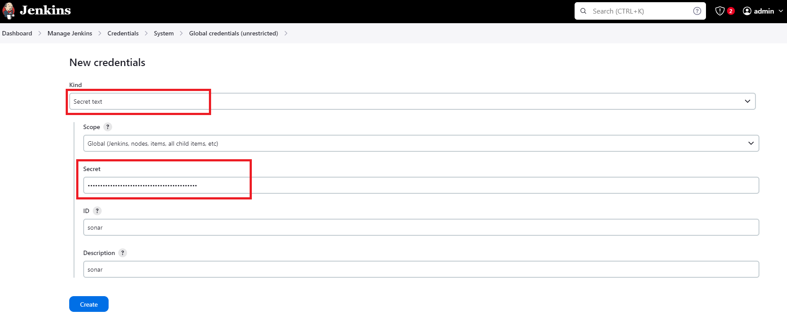

3. Go to Manage Jenkins -> System -> SonarQube installation

    Name: `sonar-server`

    Add URL of SonarQube i.e. http://<EC2_Public_IP>:9000/ and for the credential select the one added in step 2 i.e. `sonar`

    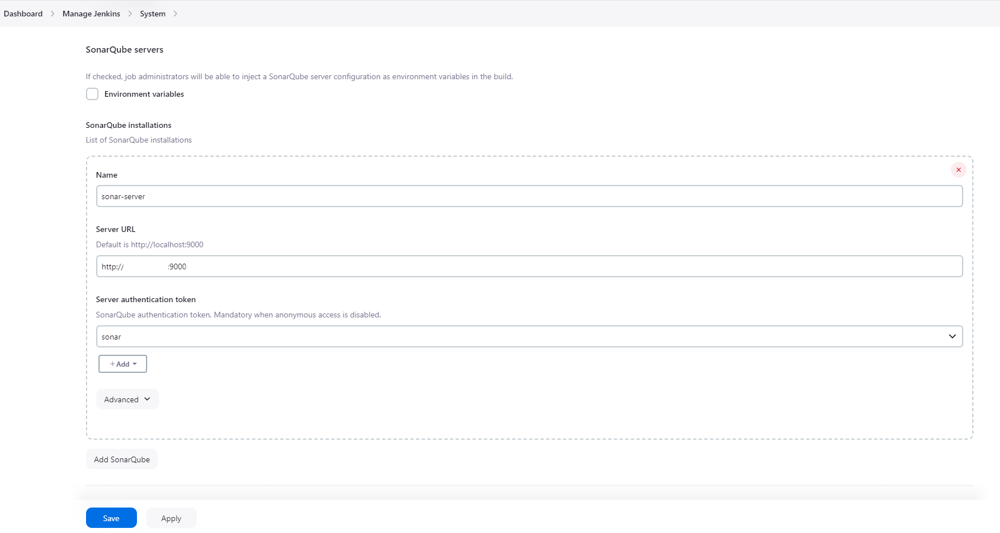

4. Go to Manage Jenkins -> Tools -> SonarQube Scanner Installations
-> Install automatically: Install from Maven Central

    Name: `sonar-scanner`

    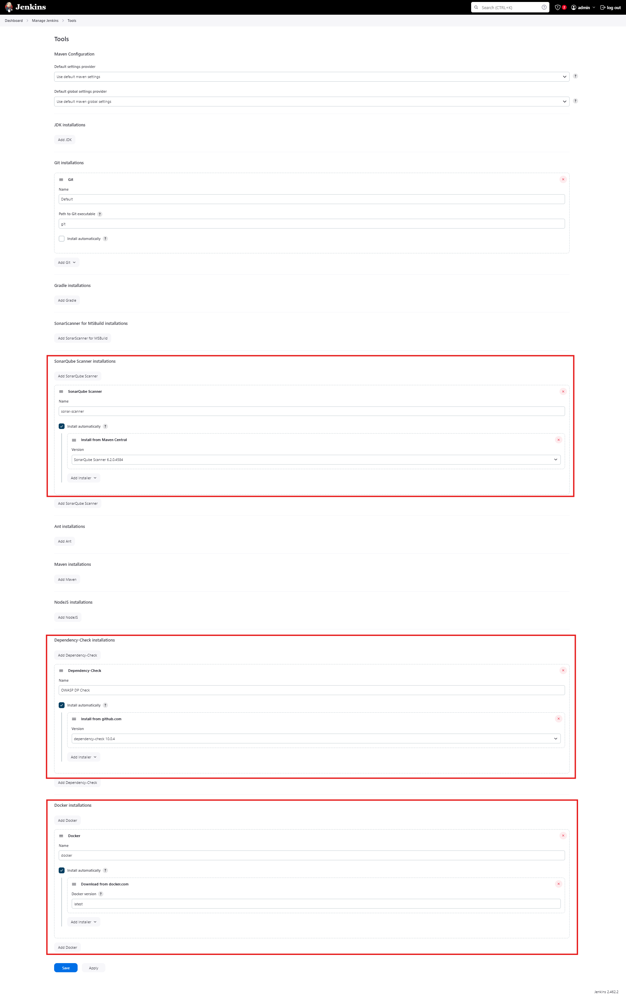

## Step 4: Set up OWASP Dependency Check 

1. Go to Manage Jenkins -> Tools -> Dependency-Check Installations
-> Install automatically: Install from github.com

    Name: `OWASP DP-Check`

## Step 5: Set up Docker for Jenkins

1. Go to Manage Jenkins -> Tools -> Docker Installations -> Install automatically: Download from docker.com

    Name: `docker`

2. And then go to Manage Jenkins -> Credentials -> System -> Global Credentials -> Add credentials. 

    Kind: `Username with password`

    Add username and password for the docker registry (You need to create an account on Dockerhub).

    ID: `docker-cred`

    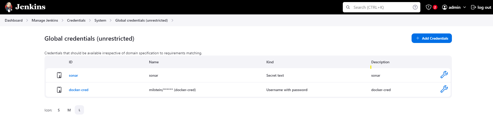

## Step 6: Create a pipeline in order to build and push the dockerized image securely using multiple security tools

Go to Dashboard -> New Item -> Pipeline

Name: `nextflix-pipeline`

1. General:

        Discard old builds: 

            Max # of builds to keep: 2

2. Pipeline:

        Script:

    Use the code below for the Jenkins pipeline. 

    ```
    pipeline {

        agent any

        environment {
            SCANNER_HOME = tool 'sonar-scanner'
            IMAGE_REPO_NAME="nextflix"
            IMAGE_TAG="latest"
            YOUR_DOCKERHUB_USERNAME = "milstein"
            // Get the `API_KEY` from https://www.themoviedb.org/
            API_KEY = "xxxxxxx"
        }
        
        stages {
            
            // Clean Workspace
            stage('clean workspace') {
                steps {
                    cleanWs()
                }
            }

            // Checkout from Git
            stage('Checkout from Git') {
                steps {
                    git branch: 'main', url: 'https://github.com/Milstein/nextflix.git'
                }
            }

            // SonarQube Analysis
            stage("Sonarqube Analysis") {
                steps {
                    withSonarQubeEnv('sonar-server') {
                        sh '''$SCANNER_HOME/bin/sonar-scanner -Dsonar.projectName=${IMAGE_REPO_NAME} \
                            -Dsonar.projectKey=${IMAGE_REPO_NAME}'''
                    }
                }
            }

            // OWASP FS SCAN
            stage('OWASP FS SCAN') {
                steps {
                    dependencyCheck additionalArguments: '--scan ./ --disableYarnAudit --disableNodeAudit', odcInstallation: 'OWASP DP-Check'
                	dependencyCheckPublisher pattern: '**/dependency-check-report.xml'
                }
            }

            // TRIVY FS SCAN
            stage('TRIVY FS SCAN') {
                steps {
                    script {
                        try {
                            sh "trivy fs . > trivyfs.txt" 
                        }catch(Exception e){
                            input(message: "Are you sure to proceed?", ok: "Proceed")
                        }
                    }
                }
            }

            // Building Docker images
            stage("Docker Build Image"){
                steps{
                    sh "docker build --build-arg API_KEY=${API_KEY} -t ${IMAGE_REPO_NAME} ."
                }
            }

            // TRIVY
            stage("TRIVY"){
                steps{
                    sh "trivy image ${IMAGE_REPO_NAME} > trivyimage.txt"
                    script{
                        input(message: "Are you sure to proceed?", ok: "Proceed")
                    }
                }
            }

            //Uploading Docker images into Docker Hub
            stage("Docker Push"){
                steps{
                    script {
                        withDockerRegistry(credentialsId: 'docker-cred', toolName: 'docker'){   
                            sh "docker tag ${IMAGE_REPO_NAME} ${YOUR_DOCKERHUB_USERNAME}/${IMAGE_REPO_NAME}:${IMAGE_TAG}"
                            sh "docker push ${YOUR_DOCKERHUB_USERNAME}/${IMAGE_REPO_NAME}:${IMAGE_TAG}"
                        }
                    }
                }
            }

            // Removing Docker images
            stage('Docker Remove Image') {
                steps {
                    script {
                        sh "docker rmi -f ${IMAGE_REPO_NAME}"
                        sh "docker rmi -f ${YOUR_DOCKERHUB_USERNAME}/${IMAGE_REPO_NAME}:${IMAGE_TAG}"
                    }
                }
            }

        }
    }
    ```

**NOTE:** Here, *API_KEY* value is gathered from: [TMDB API](https://www.themoviedb.org/).

## Step 7: Build the pipeline manually by clicking "Build Now" link

Once intitiated it will show the following to proceed in the "Console Output", click on "Proceed" as shown below:

Confirm the actions clicking `Proceed`:
```bash
...
[Pipeline] input
Are you sure to proceed?
Proceed or Abort
...
```

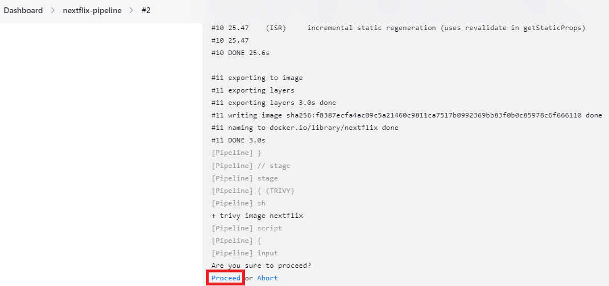

## Step 8: Create an EKS Cluster using Terraform 

**Prerequisite:** Install [kubectl](https://weaveworks-gitops.awsworkshop.io/60_workshop_6_ml/00_prerequisites.md/20_install_kubectl.html) and [helm](https://weaveworks-gitops.awsworkshop.io/70_workshop_7_multicloud/10_prerequisites/17_install_helm.html) before executing the commands below:

```bash
curl -LO https://storage.googleapis.com/kubernetes-release/release/`curl -s https://storage.googleapis.com/kubernetes-release/release/stable.txt`/bin/linux/amd64/kubectl && \
chmod +x ./kubectl && \
sudo mv ./kubectl /usr/local/bin/kubectl
```

```bash
curl -L https://get.helm.sh/helm-v3.1.2-linux-amd64.tar.gz -o helm.tar.gz
tar xvfz helm.tar.gz linux-amd64/helm
chmod +x ./linux-amd64/helm
sudo mv ./linux-amd64/helm /usr/local/bin
rm -rf ./linux-amd64
rm helm.tar.gz
```

1- Access this repository path:
```bash
cd <path>/EKS/eks-using-existing-vpc-terraform
```

- Customizing your EKS Cluster

    In this repo,  all EKS configuration are stored in terraform variables, so you need to check and edit the content of the file: `env/prd.tfvars` with your own.

**NOTE:** Please review the `README.md` file under this repository to learn more about this.

2- Initiate Terraform:
```bash
terraform init
```

3- Check and format the terraform files:
```bash
terraform fmt
```

4- Validate the terraform files:
```bash
terraform validate
```

5- Apply the scripts using the environment you want, for instance PRD:
```bash
terraform apply --var-file="env/prd.tfvars"
```

6- Confirm the actions typing `yes`:
```bash
Do you want to perform these actions?

  Terraform will perform the actions described above.
  Only 'yes' will be accepted to approve.
  Enter a value: yes
```

**Note:** The EKS Cluster creation will depend on the number and kind of resources put in the `env/prd.tfvars` file, but it wouldn't take more than 20 minutes.

## Step 9: Deploy Prometheus and Grafana on EKS 

In order to access the cluster use the command below:

```
aws eks update-kubeconfig --name "Cluster-Name" --region "Region-of-operation"
```

1. We need to add the Helm Stable Charts for your local.

    ```bash
    helm repo add stable https://charts.helm.sh/stable
    ```

2. Add prometheus Helm repo

    ```bash
    helm repo add prometheus-community https://prometheus-community.github.io/helm-charts
    ```

3. Create Prometheus namespace

    ```bash
    kubectl create namespace prometheus
    ```

4. Install kube-prometheus stack

    ```bash
    helm install stable prometheus-community/kube-prometheus-stack -n prometheus
    ```

5. Edit the service and make it LoadBalancer

    ```
    kubectl edit svc stable-kube-prometheus-sta-prometheus -n prometheus
    ```

    Find the <LOAD_BALANCER> automatically configured as EXTERNAL-IP for `stable-kube-prometheus-sta-prometheus` service by running:

    ```
    kubectl get svc stable-kube-prometheus-sta-prometheus -n prometheus
    ```

    Browse Prometheus Dashboard: http://<LOAD_BALANCER>:9090

6. Edit the grafana service too to change it to LoadBalancer

    ```
    kubectl edit svc stable-grafana -n prometheus
    ```

    Find the <LOAD_BALANCER> automatically configured as EXTERNAL-IP for `stable-grafana` service by running:

    ```
    kubectl get svc stable-grafana -n prometheus
    ```

    Browse Grafana Dashboard: http://<LOAD_BALANCER>

    Admin User: admin

    For Admin Password run:

    ```
    kubectl get secret stable-grafana -n prometheus -o jsonpath="{.data.admin-password}" | base64 --decode; echo
    ```

    Create a New Dashboard >> Import Dashboard

    Enter: **12740** which corresponds to "Kubernetes Monitoring Dashboard" and then click "Load" button as shown below:

    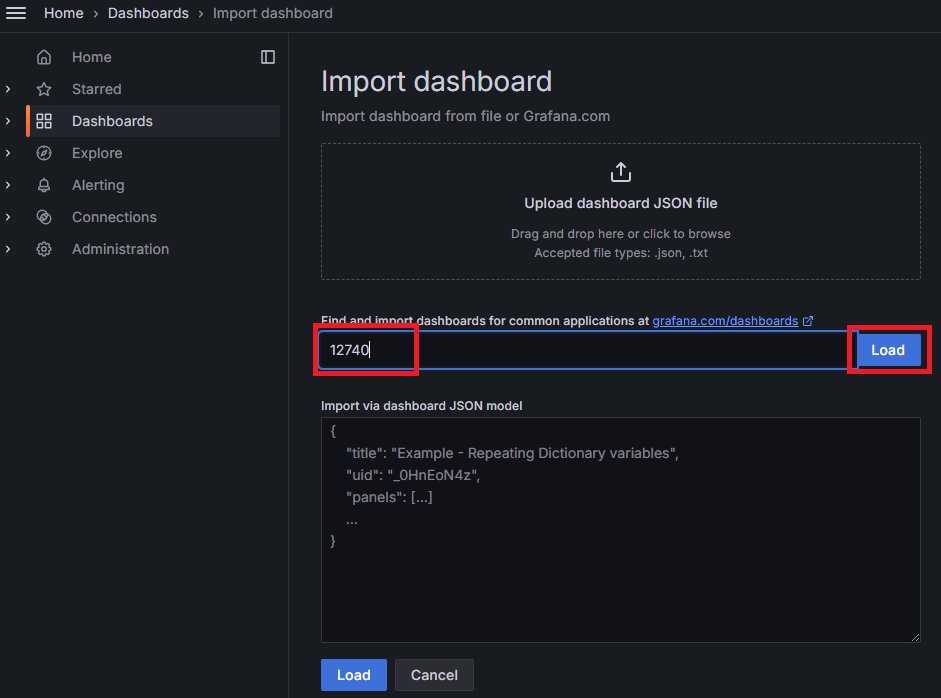

    It will show the interface like this:

    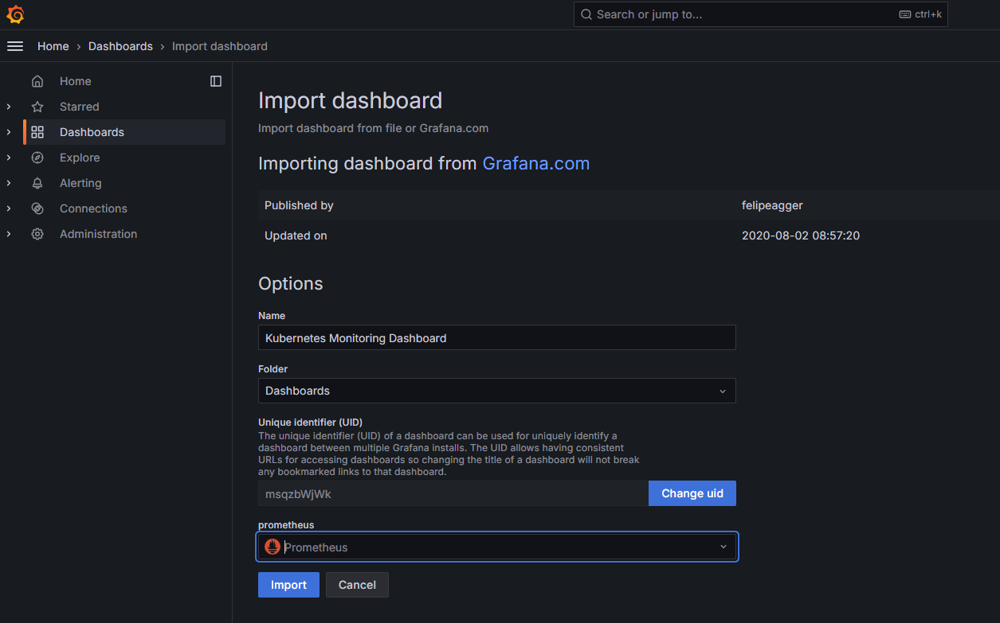

*** Make sure you select **Prometheus** from the dropdown option to load!

## Step 10: Deploy ArgoCD on EKS to fetch the manifest files to the cluster

1. Create a namespace argocd
    ```
    kubectl create namespace argocd
    ```

2. Add argocd repo locally
    ```
    kubectl apply -n argocd -f https://raw.githubusercontent.com/argoproj/argo-cd/v2.4.7/manifests/install.yaml
    ```

3. By default, argocd-server is not publically exposed. In this scenario, we will use a Load Balancer to make it usable:
    ```
    kubectl patch svc argocd-server -n argocd -p '{"spec": {"type": "LoadBalancer"}}'
    ```

4. We get the load balancer hostname using the command below:
    ```
    kubectl get svc argocd-server -n argocd -o json
    ```

5. Once you get the load balancer hostname details, you can access the ArgoCD dashboard through it.

6. We need to enter the Username and Password for ArgoCD. The username will be admin by default. For the password, we need to run the command below:

    ```
    kubectl get secret argocd-initial-admin-secret -n argocd -o jsonpath="{.data.password}" | base64 -d; echo
    ```

    Browse ArgoCD Server Dashboard: http://<LOAD_BALANCER>

    Create a new Application as shown below:

    Provide the name of your Application name, the Project name will be default, and SYNC POLICY will be Automatic then scroll down.

    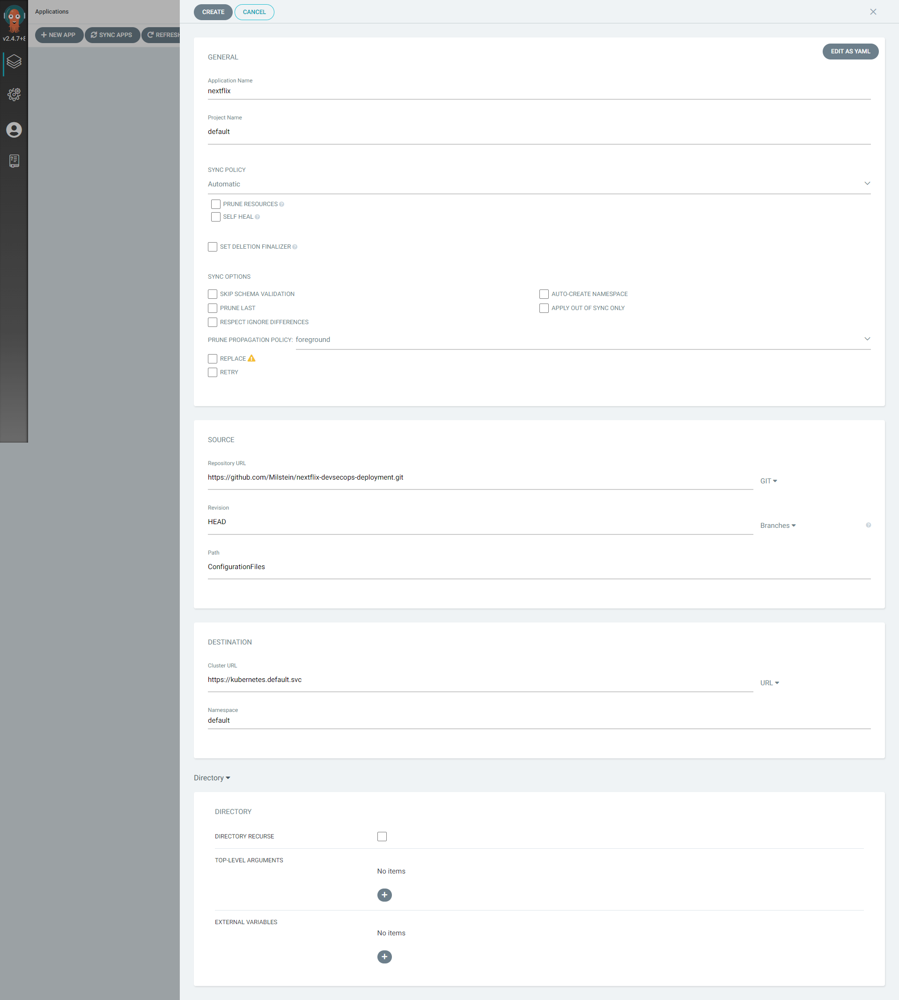

    Provide the GitHub Repo i.e. `https://github.com/Milstein/nextflix-devsecops-deployment.git`, enter the path where your deployment file is located i.e. `ConfigurationFiles`, then, Cluster URL will be `https://kubernetes.default.svc` and in the end, namespace will be `default` but you can write another namespace name.

    Click on CREATE.

    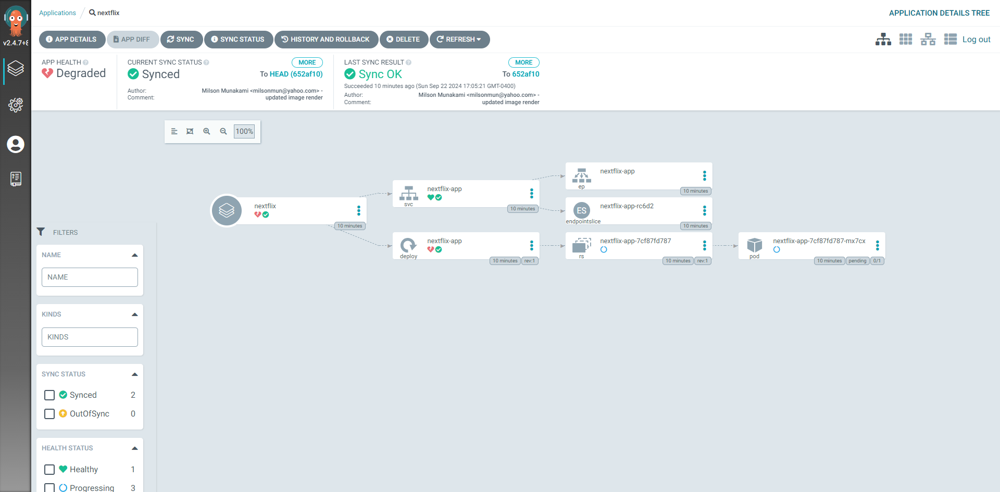

    Check the Grafana Dashboard to see the load:

    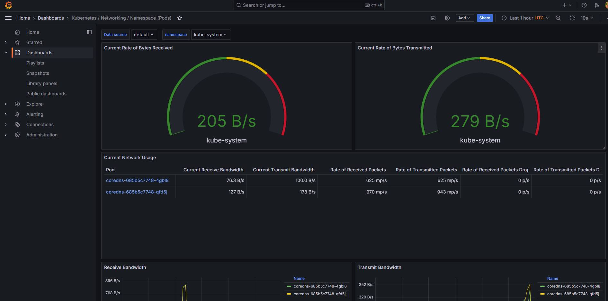

    As we specified in ArgoCD to use `default` namespace so we can check:

    `ConfigurationFiles/deployment.yaml` and `ConfigurationFiles/service.yaml`

    So running:

    ```
    kubectl get all
    NAME                               READY   STATUS    RESTARTS   AGE
    pod/nextflix-app-56f5f5c6c9-9zllk   1/1     Running   0          8m22s

    NAME                  TYPE           CLUSTER-IP       EXTERNAL-IP                                                              PORT(S)          AGE
    service/kubernetes    ClusterIP      172.20.0.1       <none>                                                                   443/TCP          165m
    service/nextflix-app   LoadBalancer   172.20.206.0   **<LOAD_BALANCER>**   3000:30147/TCP   8m22s

    NAME                          READY   UP-TO-DATE   AVAILABLE   AGE
    deployment.apps/nextflix-app   1/1     1            1           8m22s

    NAME                                     DESIRED   CURRENT   READY   AGE
    replicaset.apps/nextflix-app-56f5f5c6c9   1         1         1       8m22s
    ```

    Show the LoadBalancer url for the Nextflix web application.

    Browse the frontend Nextflix web application: http://<LOAD_BALANCER>